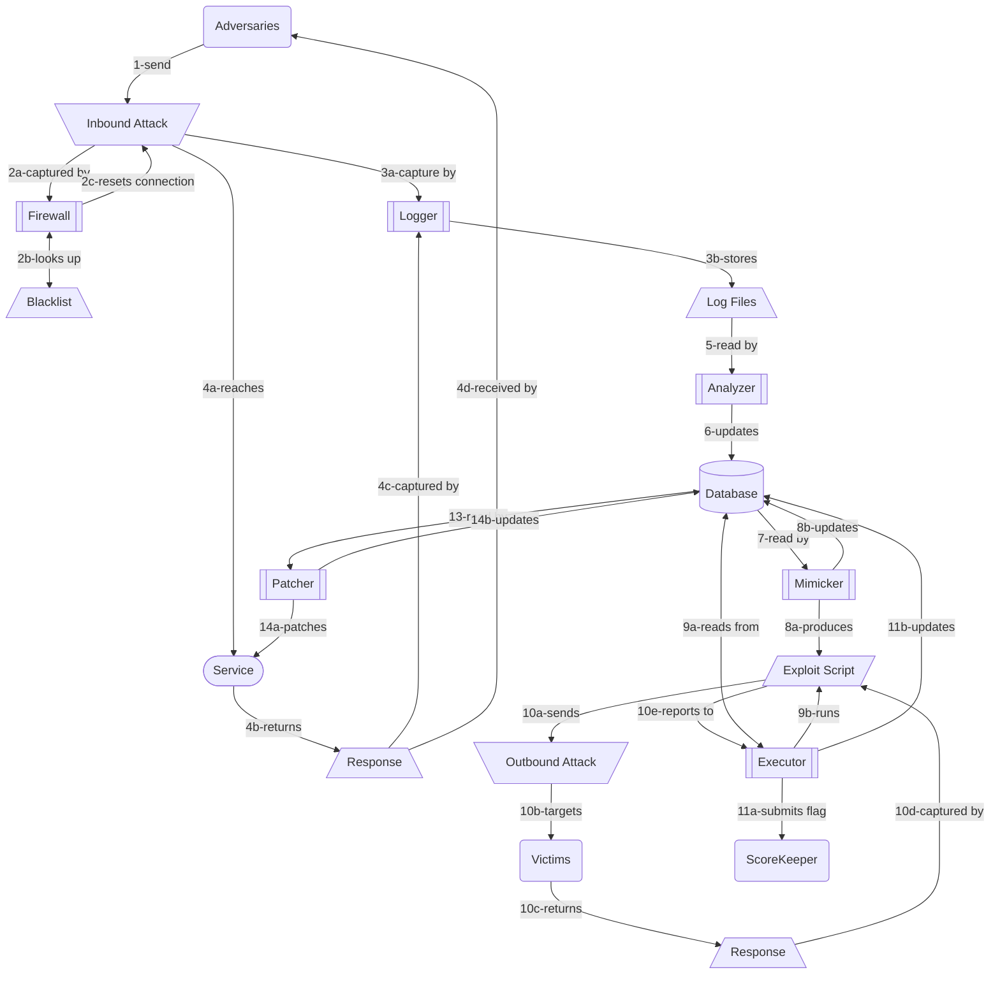

# CLAMP

### Project Description

CLAMP was developed as the final project for ASU's CSE545 Software Security, as a set of tools to more effectively play in the class CTF competition. CLAMP stands for *CTF Logger Analyzer Mimicker Patcher*, the parts that were originally conceived to be in the project. However, since the short time frame of the course precluded dependencies between the parts, and since the analyzer and mimicker depended on having an interface to the logger and sample *pcap* files similar to actual CTF attacks, we opted to replace these parts with a firewall and encryption scripts that could be used to patch services.

### The Elements

CLAMP consist of the following elements, organized by the member of the team that authored them. Despite varying contributions to code, we'd stress that each member provided equally valuable input throughout the project cycle, much of which is in between the lines of code.

#### Database (lead: Joshua Gomez)

This database stores vulnerabilities and exploit scripts. It includes models (see the [code](models.py)) using the  *sqlalchemy* ORM to provide an interface, and unit tests to make sure that it all works (see the [code](testse.py)). For more information, see the directory [data](data/).

#### Executor (lead: Jonathan Chang)

The executor and interceptor runs scripts to exploit services and reset incoming connections respectively. For more information, see the directory [executor](executor/).

#### Logger (lead: Michael Kotovsky)

The logger, configurable with *Berkeley Packet Filter (BPF)* syntax generates Wireshark .pcap files on demand. For more information, see the directory [capture](capture/).

#### Firewall (lead: Kumar Raj)

The firewall monitors incoming TCP requests and sends a reset flag whenever any keywords on its black list are encountered. For more information, see the directory [firewall](firewall/).

#### Analyzer (lead: Mehran Tajbakhsh)

The analyzer pattern matches for flags in the bodies of incoming TCP requests, and could be expanded for more functionality (see the [code](analyzer.py)). A list of useful tools during the competition was also compiled. For more information, see the directory [doc](docs/).

#### Encryption & Patching Checklists (lead: Jonathan Ong)

These are encryption snippets written in C, PHP and Python, so that we could setup the encryption patch as quickly as possible. For more information, see the directory [encryption snippets](encryption%20snippets). The patching [checklist](https://docs.google.com/document/d/13cRbKB0WiuiLUDPpQ-4POr7_HJplsGUN54HbSIjyc6Y/edit?usp=sharing) was developed to help us complete our setup thoroughly and to identify common vulnerabilities during the competition.

## Flow Diagram




### Developer Setup

1. Create a virtual Python environment

```bash
$ python3 -m venv ENV
```

2. Activate the virtual environment

```bash
$ source ENV/bin/activate
```

3. Install the dependencies

```bash
(ENV)$ pip install -r requirements.txt
```

### Testing

Tests are run with Python's standard testing package `unittest`.

```bash
(ENV)$ python -m unittest
```

### Dependencies

* Dumpcap - [https://www.wireshark.org/docs/man-pages/dumpcap.html](https://www.wireshark.org/docs/man-pages/dumpcap.html)
* PyShark 0.4.5 - [http://kiminewt.github.io/pyshark/](http://kiminewt.github.io/pyshark/)
* Redis 6.2 - [https://redis.io/documentation](https://redis.io/documentation)
* Scapy 2.4.5 - [https://scapy.readthedocs.io/en/latest/](https://scapy.readthedocs.io/en/latest/)
* SQL Alchemy 1.4 - [https://docs.sqlalchemy.org/en/14/intro.html#installation](https://docs.sqlalchemy.org/en/14/intro.html#installation)
* SQLite 3 - [https://www.sqlite.org/docs.html](https://www.sqlite.org/docs.html)
* SWPAG Client 0.3.7 - [https://pypi.org/project/swpag-client/](https://pypi.org/project/swpag-client/)

### Authors

* **Joshua Gomez** - [joshuago78](https://github.com/joshuago78)
* **Jonathan Chang** - [jachang820](https://github.com/jachang820)
* **Michael Kotovsky** - [mkotovsk-asu-edu](https://github.com/mkotovsk-asu-edu)
* **Kumar Raj** - [k-raj](https://github.com/k-raj)
* **Mehran Tajbakhsh** - [MehranTJB](https://github.com/MehranTJB)
* **Jonathan Ong** - [jonathanongucla](https://github.com/jonathanongucla)
