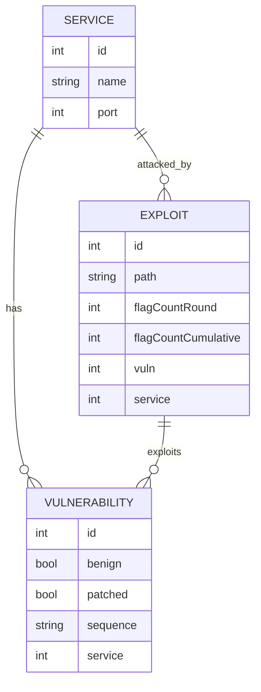

# Entity Relationship Diagram for CLAMP DB

```mermaid
erDiagram
	SERVICE ||--o{ EXPLOIT : attacked_by
	SERVICE ||--o{ VULNERABILITY : has
	SERVICE {
		int id
		string name
		int port
	}
	VULNERABILITY {
		int id
		bool benign
		bool patched
		string sequence
		int service
	}
	EXPLOIT ||--o{ VULNERABILITY: exploits
	EXPLOIT {
		int id
		string path
		int flagCountRound
		int flagCountCumulative
		int	vuln
		int service
	}
```
