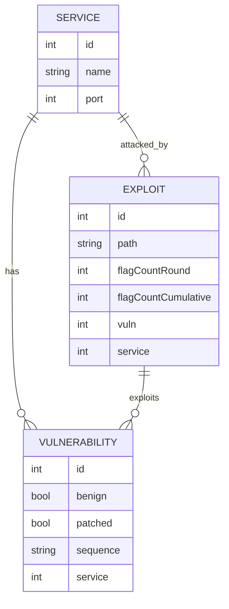

# Database

The file [models.py](../models.py) define and initialize an `sqlite3` database through the `sqlalchemy` ORM. Three tables are created: Service, Vuln, and Exploit. Each service has potentially many vulnerabilities, and each vulnerability and service have potentially many exploits, in many-to-one relationships.

## Entity Relationship Diagram for CLAMP DB



### Usage

Using the methods provided by the ORM, we could add to the database and query it without writing SQL code. To query the database, for example,

```python
engine = models.get_db_engine()
Session = models.get_db_session(engine)
Exploit = models.Exploit
with Session() as session:
  with session.begin():
    query = session.query(Exploit.query.filter(
      Exploit.path == exploit_path)
```

And to add to the database, for example,

```python
engine = models.get_db_engine()
Session = models.get_db_session(engine)
Exploit = models.Exploit
with Session() as session:
  with session.begin():
    if not session.query(Exploit.query.filter(
      Exploit.path == exploit_path).exists()
      ).scalar():

      new_exploit = Exploit(
        path = exploit_path,
        service_id = exploit_obj.service.id)
      session.add(new_exploit)
``` 