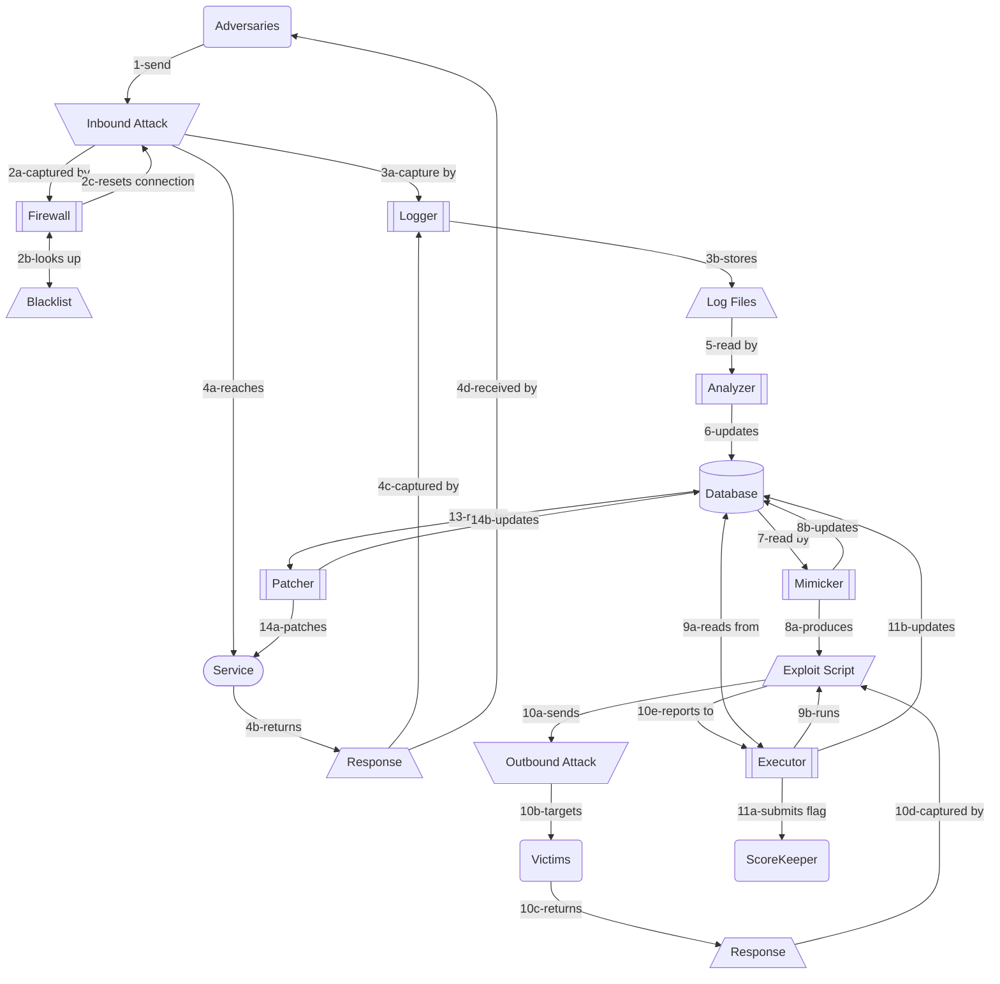

```mermaid
flowchart TD
    Adversaries(Adversaries)
    Inbound_Attack[\Inbound Attack/]
    Firewall[[Firewall]]
    Blacklist[/Blacklist\]
    Logger[[Logger]]
    Service([Service])
    Response1[/Response\]
    Log_Files[/Log Files\]
    Analyzer[[Analyzer]]
    Database[(Database)]
    Mimicker[[Mimicker]]
    Exploit[/Exploit Script/]
    Executor[[Executor]]
    Outbound_Attack[\Outbound Attack/]
    Victims(Victims)
    Response2[/Response\]
    Patcher[[Patcher]]
    ScoreKeeper(ScoreKeeper)

    Adversaries -- 1-send --> Inbound_Attack
    Inbound_Attack -- 2a-captured by --> Firewall
    Firewall <-- 2b-looks up --> Blacklist
    Firewall -- 2c-resets connection --> Inbound_Attack
    Inbound_Attack -- 3a-capture by --> Logger
    Logger -- 3b-stores --> Log_Files
    Inbound_Attack -- 4a-reaches --> Service
    Service -- 4b-returns --> Response1
    Response1 -- 4c-captured by --> Logger
    Response1 -- 4d-received by --> Adversaries
    Log_Files -- 5-read by --> Analyzer
    Analyzer -- 6-updates --> Database
    Database -- 7-read by --> Mimicker
    Mimicker -- 8a-produces --> Exploit
    Mimicker -- 8b-updates --> Database
    Executor <-- 9a-reads from --> Database
    Executor -- 9b-runs --> Exploit
    Exploit -- 10a-sends --> Outbound_Attack
    Outbound_Attack -- 10b-targets --> Victims
    Victims -- 10c-returns --> Response2
    Response2 -- 10d-captured by --> Exploit
    Exploit -- 10e-reports to --> Executor
    Executor -- 11a-submits flag --> ScoreKeeper
    Executor -- 11b-updates --> Database
    Database -- 13-read by --> Patcher
    Patcher -- 14a-patches --> Service
    Patcher -- 14b-updates --> Database
```
